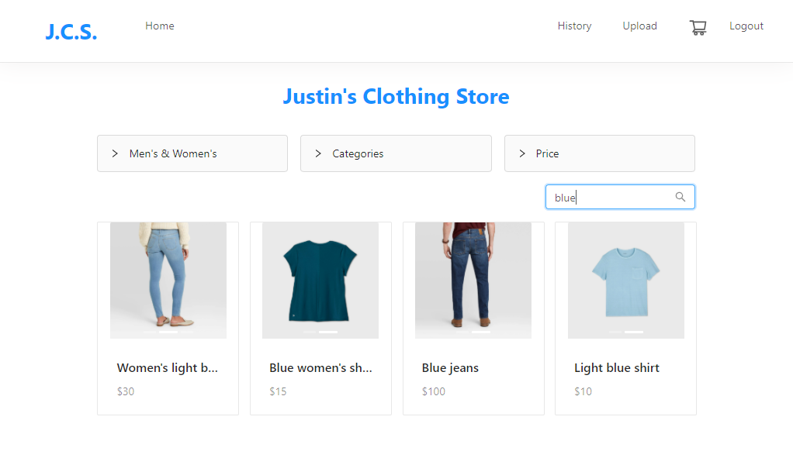

## Online Shop App
Online Store App, compatible for any type of store. 
  Allows Admin to upload items, and for shoppers to easy search items and securely purchase items in their cart.

MERN Stack, deployed on Heroku

🔗 **Live preview** of the app is [here](https://justins-online-shop.herokuapp.com).

### Purpose: ###
Showcase my ability to create a full stack application. The app utilizes a MERN stack.

App currently shows a clothing store, but the framework could be used for any time of store.

### Features: ###

* App makes it easy for shoppers to purchase items
 * Shoppers can search for products and easily add them to their cart
 * Shoppers can purchase items in their cart, using PayPal Secure Checkout
* Filter items by various categories, and price
* Search for items using the searchbar
* Click on items to visit the Product Detail Page and view specifics about the product
* Easily accesible shopping cart where shopper can see their collection of items ready to purchase
* User authentication allows for user specific carts, purchase history, and admin privledges
* Users with admin access can upload new products to the site, using the Upload Product Page
* Shoppers can easily view thier purhcase history
* Demo Page displays a clothing store, but can easily be adapted to any type of product

### Built With: ###

* ReactJS
* JavaScript
* NodeJS
* ExpressJS
* MongoDB
* Redux
* HTML/CSS
* Paypal Checkout
* Heroku Hosting

### Pictures: ###

#### Main Page: ####

#### Shoppers can filter items by Category, Gender, and Price: #### 

#### Shoppers can search for specific items or attributes: #### 

#### Product Detail Page: #### 

#### User specific shopping cart: #### 

#### Admin can upload new products to be sold: #### 

#### Page for user specific purchase history: #### 

#### Ensure a secure checkout with PayPal Checkout: #### 

#### User Authentication: #### 

